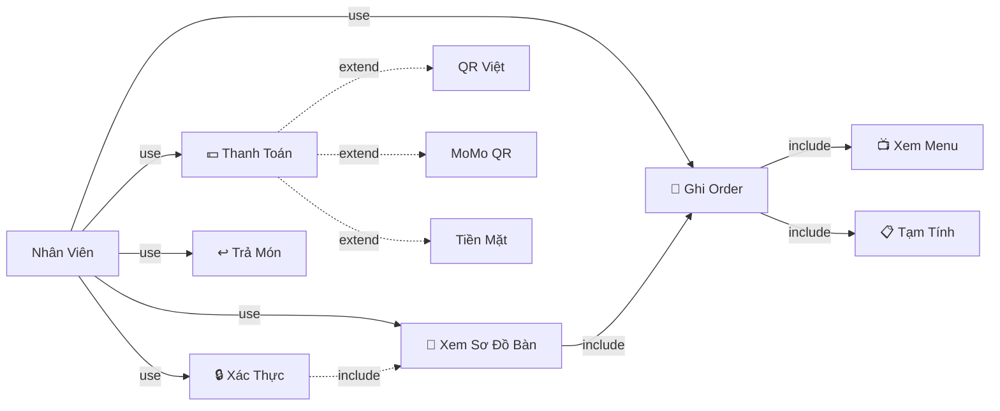

# Use Case Diagram - Hệ Thống Quản Lý Nhà Hàng (AppDatDoHub)

## 📋 Mục Lục
1. [Sơ Đồ Tổng Quát](#sơ-đồ-tổng-quát)
2. [Phân Tích Actor](#phân-tích-actor)
3. [Use Case Chi Tiết Cho Từng Role](#use-case-chi-tiết-cho-từng-role)
4. [Hướng Dẫn Vẽ Sơ Đồ](#hướng-dẫn-vẽ-sơ-đồ)

---

## 🎯 Sơ Đồ Tổng Quát (General Use Case Diagram)

### Sơ Đồ Tương Tác Chính Của Các Actors Với Hệ Thống

```
┌────────────────────────────────────────────────────────────────────────┐
│                     AppDatDoHub System                                 │
├────────────────────────────────────────────────────────────────────────┤
│                                                                        │
│  ┌────────────┐      ┌────────────┐      ┌────────────┐              │
│  │  Nhân      │      │   Thu      │      │   Admin    │              │
│  │  Viên      │      │   Ngân     │      │            │              │
│  └──────┬─────┘      └──────┬─────┘      └──────┬─────┘              │
│         │                   │                   │                    │
│         │                   │                   │                    │
│         └───────────────────┼───────────────────┘                    │
│                             │                                        │
│                             ▼                                        │
│         ┌──────────────────────────────────────┐                    │
│         │  [Xác Thực & Đăng Nhập]             │                    │
│         └──────────────────┬───────────────────┘                    │
│                            │                                        │
│            ┌───────────────┼───────────────┐                        │
│            ▼               ▼               ▼                        │
│       ┌──────────┐  ┌────────────┐  ┌───────────┐                 │
│       │ [Xem    │  │ [Xem       │  │ [Xem      │                 │
│       │  Sơ Đồ  │  │  Dashboard │  │  Dashboard│                 │
│       │  Bàn]   │  │  Tài Chính]│  │  Admin]   │                 │
│       └─────┬────┘  └────┬───────┘  └─────┬─────┘                 │
│             │            │               │                        │
│             ▼            ▼               ▼                        │
│       ┌──────────┐  ┌────────────┐  ┌──────────────┐             │
│       │ [Ghi    │  │ [Quản Lý   │  │ [Quản Lý    │             │
│       │  Order  │  │  Quỹ & Chi │  │  Đơn Hàng]  │             │
│       │  & Bàn] │  │  Phí]      │  │             │             │
│       └─────┬────┘  └────┬───────┘  └─────────────┘             │
│             │            │                                      │
│             ▼            ▼                                      │
│       ┌──────────┐  ┌────────────┐                             │
│       │ [Thanh   │  │ [Quản Lý   │                             │
│       │  Toán &  │  │  Báo Cáo]  │                             │
│       │  Trả    │  │             │                             │
│       │  Món]   │  │             │                             │
│       └──────────┘  └────────────┘                             │
│                                                                 │
│         ┌────────────┐                                         │
│         │   Bếp      │                                         │
│         └──────┬─────┘                                         │
│                ▼                                                │
│         ┌──────────────┐                                       │
│         │ [Xem & Xử Lý │                                       │
│         │  Order]      │                                       │
│         └──────────────┘                                       │
│                                                                 │
└────────────────────────────────────────────────────────────────────────┘
```

### Danh Sách Chức Năng Chính (Main Use Cases)

| Actor | Chức Năng Chính | Mô Tả |
|---|---|---|
| **Nhân Viên** | Xem Sơ Đồ Bàn | Xem layout các bàn trong nhà hàng |
| **Nhân Viên** | Ghi Order & Quản Lý Bàn | Ghi order cho bàn, quản lý các order |
| **Nhân Viên** | Thanh Toán & Trả Món | Xử lý thanh toán, ghi nhận trả món |
| **Thu Ngân** | Xem Dashboard Tài Chính | Xem tổng doanh thu, lợi nhuận |
| **Thu Ngân** | Quản Lý Quỹ & Chi Phí | Quản lý tiền mặt, ngân hàng, chi phí |
| **Thu Ngân** | Quản Lý Báo Cáo | Xem báo cáo doanh thu, lợi nhuận, hàng tồn |
| **Admin** | Xem Dashboard Admin | Xem thống kê tổng quát hệ thống |
| **Admin** | Quản Lý Đơn Hàng | Xem và quản lý tất cả order |
| **Bếp** | Xem & Xử Lý Order | Xem order cần làm, cập nhật trạng thái |

---

## 👥 Phân Tích Actor

### 1. **Nhân Viên (Nhan_Vien)** 
**Vai trò chính:** Tiếp khách, ghi order, phục vụ
- Xem được: Bàn, danh sách order, trả món, tạm tính
- Không xem được: Tài chính, quản lý hệ thống, báo cáo admin
- Chức năng:
  - Chọn bàn → Xem menu → Ghi order → Tạm tính → Thanh toán (đơn giản)
  - Xử lý trả món
  - Xem lịch sử hóa đơn

### 2. **Thu Ngân (Thu_Ngan)**
**Vai trò chính:** Quản lý tài chính, doanh thu, chi phí
- Xem được: Tất cả chức năng của Nhân Viên + Dashboard tài chính + Quản lý quỹ + Báo cáo
- Không xem được: Quản lý hệ thống, cấu hình menu sâu, quản lý người dùng
- Chức năng thêm:
  - Dashboard doanh thu, lợi nhuận
  - Quản lý quỹ tiền mặt, quỹ ngân hàng
  - Chi phí, khuyến mãi
  - Quản lý hàng tồn kho (mua hàng, tồn kho)
  - Báo cáo chi tiết bán hàng, lợi nhuận

### 3. **Admin (Admin)**
**Vai trò chính:** Quản lý toàn bộ hệ thống
- Xem được: Tất cả chức năng
- Không giới hạn
- Chức năng:
  - Xem danh sách đơn hàng
  - Thống kê, báo cáo tổng quát
  - Quản lý hệ thống (tiện ích admin)

### 4. **Bếp (Kitchen)**
**Vai trò chính:** Xử lý order, làm món ăn, quản lý tồn kho
- Xem được: Đơn hàng cần làm, tóm tắt món, số lượng
- Không xem được: Tài chính, thanh toán, quản lý người dùng
- Chức năng:
  - Xem danh sách order cần làm
  - Cập nhật trạng thái món
  - Quản lý tồn kho
  - Báo cáo xử lý order

---

## 📱 Use Case Chi Tiết Cho Từng Role


---

### **PHẦN 1: USE CASE CHI TIẾT - NHÂN VIÊN (Nhan_Vien)**

#### **1.1 Sơ Đồ Chi Tiết: Ghi Order**

```
┌──────────────────────────────────────────────────────────────┐
│                    Ghi Order (PlaceOrder)                    │
├──────────────────────────────────────────────────────────────┤
│                                                              │
│  ┌────────────┐                                             │
│  │ Nhân Viên  │                                             │
│  └─────┬──────┘                                             │
│        │                                                    │
│        ├──────────────────────────────────────┐             │
│        │                                      │             │
│        ▼                                      ▼             │
│  ┌──────────────┐     ◄◄include◄◄   ┌─────────────────┐   │
│  │ Ghi Order    │◄─ ─ ─ ─ ─ ─ ─ ─►  │ 1. Xem Menu    │   │
│  │(PlaceOrder)  │                   │    (ViewMenu)  │   │
│  └──────┬───────┘                   └─────────────────┘   │
│         │                                                 │
│         │     ◄◄include◄◄                                │
│         ├──────────────────────────────────┐             │
│         │                                  │             │
│         ▼                                  ▼             │
│  ┌──────────────┐   ◄◄include◄◄   ┌──────────────────┐  │
│  │              │◄─ ─ ─ ─ ─ ─ ─ ─►│ 2. Chọn Bàn     │  │
│  │              │                  │    (SelectTable)│  │
│  │ (PlaceOrder) │                  └──────────────────┘  │
│  │              │                                        │
│  └──────┬───────┘  ◄◄include◄◄                          │
│         │◄─ ─ ─ ─ ─ ─ ─ ─ ─┐                            │
│         │                   ▼                            │
│         │          ┌──────────────────┐                 │
│         │          │ 3. Tùy Chỉnh     │                 │
│         │          │    Món Ăn        │                 │
│         │          │(CustomizeItem)   │                 │
│         │          └──────────────────┘                 │
│         │                                               │
│         │    ◄◄include◄◄                               │
│         └──────────────────────────────┐               │
│                                        ▼               │
│                          ┌──────────────────────┐      │
│                          │ 4. Xem Tạm Tính     │      │
│                          │    (ViewBill)       │      │
│                          └──────────────────────┘      │
│                                                         │
└──────────────────────────────────────────────────────────┘
```

#### **1.2 Sơ Đồ Chi Tiết: Thanh Toán**

```
┌──────────────────────────────────────────────────────────────┐
│                  Thanh Toán (Payment)                        │
├──────────────────────────────────────────────────────────────┤
│                                                              │
│  ┌────────────┐                                             │
│  │ Nhân Viên  │                                             │
│  └─────┬──────┘                                             │
│        │                                                    │
│        ▼                                                    │
│  ┌──────────────┐                                           │
│  │  Thanh Toán  │                                           │
│  │ (Payment)    │                                           │
│  └──────┬───────┘                                           │
│         │                                                  │
│    ┌────┴──────────────┐                                  │
│    │                   │                                  │
│    ▼                   ▼                                  │
│ ┌────────────────┐ ┌─────────────────┐                  │
│ │ ◄◄include◄◄    │ │ ◄◄include◄◄     │                  │
│ │ 1. VietQR      │ │ 2. MoMo QR      │                  │
│ │    Payment     │ │    Payment      │                  │
│ │(PaymentVietQR) │ │(PaymentMoMo)    │                  │
│ └────────────────┘ └─────────────────┘                  │
│         ▲                   ▲                            │
│         │                   │                            │
│         └─────┬─────────────┘                            │
│               │                                          │
│               ▼                                          │
│       ┌──────────────┐                                   │
│       │ ◄◄extend◄◄   │                                   │
│       │ 3. Thanh Toán│                                   │
│       │    Tiền      │                                   │
│       │ (PaymentCash)│                                   │
│       └──────────────┘                                   │
│                                                          │
│       ┌──────────────────┐                              │
│       │ ◄◄extend◄◄       │                              │
│       │ 4. In Hóa Đơn   │                              │
│       │   (PrintBill)   │                              │
│       └──────────────────┘                              │
│                                                          │
└──────────────────────────────────────────────────────────┘
```

#### **1.3 Sơ Đồ Chi Tiết: Xử Lý Trả Món**

```
┌──────────────────────────────────────────────────────────────┐
│              Xử Lý Trả Món (ReturnItems)                    │
├──────────────────────────────────────────────────────────────┤
│                                                              │
│  ┌────────────┐                                             │
│  │ Nhân Viên  │                                             │
│  └─────┬──────┘                                             │
│        │                                                    │
│        ▼                                                    │
│  ┌──────────────┐                                           │
│  │ Xử Lý Trả    │                                           │
│  │ Món          │                                           │
│  │ (ReturnItems)│                                           │
│  └──────┬───────┘                                           │
│         │                                                  │
│    ┌────┼──────────────────────┐                          │
│    │    │                      │                          │
│    ▼    ▼                      ▼                          │
│ ┌──────────┐  ┌─────────────┐  ┌──────────────┐           │
│ │ ◄◄inc◄◄  │  │ ◄◄include◄◄│  │ ◄◄include◄◄ │           │
│ │ 1. Chọn  │  │ 2. Ghi      │  │ 3. Chọn Lý  │           │
│ │    Món   │  │    Ghi      │  │    Do Trả   │           │
│ │(SelectItem│ │    Chú      │  │(SelectReason│           │
│ │)         │  │(AddNote)    │  │)            │           │
│ └──────────┘  └─────────────┘  └──────┬──────┘           │
│                                        │                  │
│                                        ▼                  │
│                             ┌──────────────────┐          │
│                             │ ◄◄extend◄◄       │          │
│                             │ 4. Hoàn Tiền    │          │
│                             │   (Refund)      │          │
│                             └──────────────────┘          │
│                                                           │
│                             ┌──────────────────┐          │
│                             │ ◄◄extend◄◄       │          │
│                             │ 5. Gửi Bếp      │          │
│                             │   Làm Lại       │          │
│                             │(SendToKitchen)  │          │
│                             └──────────────────┘          │
│                                                           │
└──────────────────────────────────────────────────────────────┘
```

#### **1.4 Chi Tiết Use Case Nhân Viên (Bảng Tham Khảo)**

| Use Case ID | Use Case Name | Mô Tả | Actor | Điều Kiện Trước | Điều Kiện Sau | Luồng Chính | Luồng Ngoại Lệ |
|---|---|---|---|---|---|---|---|
| UC-NV-01 | Xác Thực (Authenticate) | Nhân viên đăng nhập vào hệ thống | Nhân Viên | Chưa đăng nhập | Đã đăng nhập thành công | 1. Mở app<br>2. Nhập số điện thoại/email<br>3. Nhập mật khẩu<br>4. Nhấn Đăng Nhập<br>5. Hệ thống xác thực<br>6. Vào Dashboard | Sai thông tin → Thông báo lỗi<br>Mất kết nối → Tải lại |
| UC-NV-02 | Xem Sơ Đồ Bàn (ViewTableLayout) | Nhân viên xem danh sách các bàn trong nhà hàng | Nhân Viên | Đã đăng nhập | Thấy danh sách bàn | 1. Vào tab "Sơ đồ"<br>2. Hiển thị tất cả bàn<br>3. Mỗi bàn hiển thị trạng thái<br>4. Chọn bàn để thao tác | Không có bàn → Thông báo |
| UC-NV-03 | Chọn Bàn (SelectTable) | Nhân viên chọn một bàn để phục vụ | Nhân Viên | Xem được danh sách bàn | Bàn được chọn | 1. Tap vào bàn trên sơ đồ<br>2. Xem thông tin bàn<br>3. Chọn hành động (ghi order, xem order, etc.)<br>4. Hệ thống load dữ liệu | Bàn không khả dụng → Thông báo |
| UC-NV-04 | Xem Menu (ViewMenu) | Nhân viên xem danh sách các món ăn | Nhân Viên | Vào screen ghi order | Thấy danh sách menu | 1. Tap vào bàn<br>2. Chọn "Ghi order"<br>3. Hiển thị menu<br>4. Phân loại theo category<br>5. Xem ảnh, giá, mô tả | Không load được → Thông báo |
| UC-NV-05 | Ghi Order (PlaceOrder) | Nhân viên tạo order mới cho bàn | Nhân Viên | Chọn được bàn | Order được lưu | 1. Chọn bàn<br>2. Tap "Ghi order"<br>3. Xem menu<br>4. Chọn món<br>5. Nhập số lượng<br>6. Tùy chỉnh (nếu cần)<br>7. Thêm vào order<br>8. Xem tạm tính<br>9. Xác nhận gửi bếp<br>10. Order được lưu, bếp nhận | Không chọn món → Không ghi được<br>Mất kết nối → Lưu offline |
| UC-NV-06 | Tùy Chỉnh Món (CustomizeItem) | Nhân viên tùy chỉnh chi tiết món ăn | Nhân Viên | Chọn được món | Món được tùy chỉnh | 1. Tap vào món<br>2. Mở modal tùy chỉnh<br>3. Chọn option group<br>4. Chọn option choice<br>5. Xác nhận<br>6. Trở về order list | Không có option → Bỏ qua |
| UC-NV-07 | Xem Tạm Tính (ViewBill) | Nhân viên xem chi tiết order hiện tại | Nhân Viên | Có order trên bàn | Thấy chi tiết order | 1. Chọn bàn<br>2. Tap "Tạm tính"<br>3. Hiển thị:<br>  - Danh sách món<br>  - Giá từng món<br>  - Tổng tiền<br>  - Thành tiền | Không có order → Thông báo |
| UC-NV-08 | Thanh Toán (Payment) | Nhân viên xử lý thanh toán cho order | Nhân Viên | Có order hoàn thành | Order được đóng | 1. Chọn bàn<br>2. Xem tạm tính<br>3. Chọn phương thức thanh toán:<br>  a. Tiền mặt<br>  b. VietQR<br>  c. MoMo<br>4. Xác nhận<br>5. In hóa đơn (tuỳ chọn)<br>6. Đóng order | Mất kết nối → Thông báo<br>Hủy thanh toán → Quay lại |
| UC-NV-09 | Xử Lý Trả Món (ReturnItems) | Nhân viên ghi nhận và xử lý trả món | Nhân Viên | Khách hàng yêu cầu trả | Trả món được xác nhận | 1. Vào tab "Trả Món"<br>2. Chọn order/bàn<br>3. Chọn món cần trả<br>4. Ghi nhân xét (nếu cần)<br>5. Chọn lý do trả<br>6. Gửi bếp (hoặc hoàn tiền)<br>7. Cập nhật order | Không chọn món → Thông báo |
| UC-NV-10 | Xem Lịch Sử Hóa Đơn (BillHistory) | Nhân viên xem các hóa đơn đã thanh toán | Nhân Viên | Hoàn thành order | Thấy danh sách hóa đơn | 1. Vào tab "Tiện ích"<br>2. Chọn "Lịch sử hóa đơn"<br>3. Lọc theo ngày/thời gian<br>4. Xem chi tiết hóa đơn<br>5. In hoặc chia sẻ | Không có hóa đơn → Thông báo |

---

### **PHẦN 2: USE CASE CHI TIẾT - THU NGÂN (Thu_Ngan)**

#### **2.1 Sơ Đồ Chi Tiết: Quản Lý Quỹ**

```
┌──────────────────────────────────────────────────────────────┐
│              Quản Lý Quỹ (FundManagement)                   │
├──────────────────────────────────────────────────────────────┤
│                                                              │
│  ┌────────────┐                                             │
│  │  Thu Ngân  │                                             │
│  └─────┬──────┘                                             │
│        │                                                    │
│        ▼                                                    │
│  ┌──────────────┐                                           │
│  │ Quản Lý Quỹ  │                                           │
│  │(FundMgmt)    │                                           │
│  └──────┬───────┘                                           │
│         │                                                  │
│    ┌────┼──────────────────────┐                          │
│    │    │                      │                          │
│    ▼    ▼                      ▼                          │
│ ┌──────────┐  ┌─────────────┐  ┌──────────────┐           │
│ │ ◄◄inc◄◄  │  │ ◄◄include◄◄│  │ ◄◄include◄◄ │           │
│ │ 1. Quỹ   │  │ 2. Quỹ      │  │ 3. Ghi      │           │
│ │    Tiền  │  │    Ngân     │  │    Nhận Quỹ │           │
│ │    Mặt   │  │    Hàng     │  │(RecordFund) │           │
│ │(CashFund)│  │(BankFund)   │  │             │           │
│ └──────────┘  └─────────────┘  └──────────────┘           │
│      │                │              │                     │
│      └────────┬───────┴──────────────┘                     │
│               │                                             │
│               ▼                                             │
│      ┌──────────────────┐                                  │
│      │ ◄◄extend◄◄       │                                  │
│      │ 4. Xuất Báo Cáo │                                  │
│      │    Quỹ          │                                  │
│      │(ExportFundReport│                                  │
│      └──────────────────┘                                  │
│                                                            │
└──────────────────────────────────────────────────────────────┘
```

#### **2.2 Sơ Đồ Chi Tiết: Quản Lý Báo Cáo**

```
┌──────────────────────────────────────────────────────────────┐
│             Quản Lý Báo Cáo (ReportManagement)              │
├──────────────────────────────────────────────────────────────┤
│                                                              │
│  ┌────────────┐                                             │
│  │  Thu Ngân  │                                             │
│  └─────┬──────┘                                             │
│        │                                                    │
│        ▼                                                    │
│  ┌──────────────┐                                           │
│  │ Quản Lý      │                                           │
│  │ Báo Cáo      │                                           │
│  │(ReportMgmt)  │                                           │
│  └──────┬───────┘                                           │
│         │                                                  │
│    ┌────┼────────────────────┐                            │
│    │    │                    │                            │
│    ▼    ▼                    ▼                            │
│ ┌──────────┐  ┌────────────┐  ┌──────────────┐            │
│ │ ◄◄inc◄◄  │  │ ◄◄include◄│  │ ◄◄include◄◄ │            │
│ │ 1. Báo   │  │ 2. Báo    │  │ 3. Top      │            │
│ │    Cáo   │  │    Cáo    │  │    Sản      │            │
│ │    Doanh │  │    Lợi    │  │    Phẩm     │            │
│ │    Thu   │  │    Nhuận  │  │(TopItems)   │            │
│ │(SalesRpt)│  │(ProfitRpt)│  │             │            │
│ └──────────┘  └────────────┘  └──────────────┘            │
│      │              │              │                      │
│      └──────┬───────┴──────────────┘                      │
│             │                                              │
│             ▼                                              │
│    ┌──────────────────┐                                   │
│    │ ◄◄extend◄◄       │                                   │
│    │ 4. Xuất Excel/   │                                   │
│    │    PDF Báo Cáo   │                                   │
│    │(ExportReport)    │                                   │
│    └──────────────────┘                                   │
│                                                            │
└──────────────────────────────────────────────────────────────┘
```

#### **2.3 Sơ Đồ Chi Tiết: Quản Lý Tồn Kho**

```
┌──────────────────────────────────────────────────────────────┐
│            Quản Lý Tồn Kho (InventoryManagement)            │
├──────────────────────────────────────────────────────────────┤
│                                                              │
│  ┌────────────┐                                             │
│  │  Thu Ngân  │                                             │
│  └─────┬──────┘                                             │
│        │                                                    │
│        ▼                                                    │
│  ┌──────────────┐                                           │
│  │ Quản Lý      │                                           │
│  │ Tồn Kho      │                                           │
│  │(InventoryMgt)│                                           │
│  └──────┬───────┘                                           │
│         │                                                  │
│    ┌────┼──────────────────────┐                          │
│    │    │                      │                          │
│    ▼    ▼                      ▼                          │
│ ┌──────────┐  ┌─────────────┐  ┌──────────────┐           │
│ │ ◄◄inc◄◄  │  │ ◄◄include◄◄│  │ ◄◄include◄◄ │           │
│ │ 1. Xem   │  │ 2. Tạo      │  │ 3. Xem      │           │
│ │    Tồn   │  │    Đơn      │  │    Chi Tiết │           │
│ │    Kho   │  │    Mua      │  │    Tồn Kho  │           │
│ │(ViewInvt)│  │(CreatePOrder│  │(InvDetail)  │           │
│ │          │  │)            │  │             │           │
│ └──────────┘  └─────────────┘  └──────────────┘           │
│                                                            │
└──────────────────────────────────────────────────────────────┘
```

#### **2.4 Bảng Chi Tiết Use Case Thu Ngân

Xem bảng dưới đây để hiểu rõ từng chức năng của Thu Ngân:

| Use Case ID | Chức Năng | Mô Tả Ngắn |
|---|---|---|
| UC-TN-01 | Xem Dashboard | Xem tổng doanh thu, lợi nhuận, số order hôm nay |
| UC-TN-02 | Quỹ Tiền Mặt | Quản lý, rút/nạp tiền, lịch sử giao dịch |
| UC-TN-03 | Quỹ Ngân Hàng | Quản lý chuyển khoản, lịch sử giao dịch |
| UC-TN-04 | Báo Cáo Doanh Thu | Xem chi tiết bán hàng theo thời gian, phương thức |
| UC-TN-05 | Báo Cáo Lợi Nhuận | Xem chi tiết lợi nhuận, lợi nhuận ròng |
| UC-TN-06 | Quản Lý Tồn Kho | Xem, tìm kiếm, chi tiết từng SKU |
| UC-TN-07 | Tạo Đơn Mua | Tạo đơn mua hàng từ nhà cung cấp |
| UC-TN-08 | Ghi Nhận Chi Phí | Ghi nhận chi phí hoạt động hàng ngày |
| UC-TN-09 | Quản Lý Khuyến Mãi | Tạo, kích hoạt, sửa khuyến mãi |
| UC-TN-10 | Top Sản Phẩm | Xem sản phẩm bán chạy nhất |
| UC-TN-11 | Lịch Sử Hoạt Động | Xem log toàn bộ hoạt động hệ thống |

---

### **PHẦN 4: USE CASE CHI TIẾT CHO ADMIN (Admin)**

#### **4.1 Sơ Đồ Tổng Quát Admin**

```
┌──────────────────────────────────────────────────────────────┐
│            USE CASE ADMIN (Admin)                           │
├──────────────────────────────────────────────────────────────┤
│                                                              │
│  ┌──────────┐                                               │
│  │  Admin   │                                               │
│  └────┬─────┘                                               │
│       │                                                     │
│  ┌────┴──────────────────────────┐                         │
│  │                               │                         │
│  ▼                               ▼                         │
│ ┌──────────────┐        ┌──────────────────┐              │
│ │ Xác Thực     │        │ Xem Dashboard    │              │
│ │(Auth)        ├─inc─► │ Admin            │              │
│ └──────────────┘       │ - Thống kê tổng  │              │
│                        │ - Các chỉ số KPI │              │
│                        │ - Biểu đồ        │              │
│                        └────────┬─────────┘              │
│    ┌─────────────────────────────┘                       │
│    │                                                     │
│    ▼                                                     │
│ ┌────────────────────┐                                  │
│ │ Quản Lý Đơn Hàng   │                                  │
│ │(ManageOrders)      │                                  │
│ │ - Xem tất cả order │                                  │
│ │ - Lọc theo trạng   │                                  │
│ │   thái             │                                  │
│ │ - Xem chi tiết     │                                  │
│ │ - Thống kê         │                                  │
│ └────────────────────┘                                  │
│    │                                                     │
│    ▼                                                     │
│ ┌────────────────────┐                                  │
│ │ Tiện Ích Admin     │                                  │
│ │(AdminUtilities)    │                                  │
│ │ - Báo cáo tổng hợp │                                  │
│ │ - Quản lý người    │                                  │
│ │   dùng (future)    │                                  │
│ │ - Cấu hình hệ      │                                  │
│ │   thống (future)   │                                  │
│ └────────────────────┘                                  │
│                                                          │
└──────────────────────────────────────────────────────────┘
```

#### **4.2 Chi Tiết Use Case Admin**

| Use Case ID | Use Case Name | Mô Tả | Actor | Điều Kiện Trước | Điều Kiện Sau | Luồng Chính | Luồng Ngoại Lệ |
|---|---|---|---|---|---|---|---|
| UC-AD-01 | Xem Dashboard Admin (AdminDashboard) | Admin xem tổng quan hệ thống | Admin | Đã đăng nhập | Thấy thống kê tổng | 1. Vào tab Dashboard<br>2. Hiển thị:<br>  - Tổng doanh thu<br>  - Số order hôm nay<br>  - Số nhân viên online<br>  - Thống kê chung<br>3. Lọc theo ngày/tháng/năm<br>4. Xem biểu đồ xu hướng | Không có dữ liệu → Thông báo |
| UC-AD-02 | Xem Danh Sách Đơn Hàng (AdminOrders) | Admin xem tất cả đơn hàng trong hệ thống | Admin | Có đơn hàng | Thấy danh sách đơn | 1. Vào tab "Đơn hàng"<br>2. Hiển thị tất cả order<br>3. Hiển thị trạng thái:<br>  - Chờ thanh toán<br>  - Đã thanh toán<br>  - Hoàn thành<br>  - Đã đóng<br>  - Hủy<br>4. Lọc theo trạng thái<br>5. Tap chi tiết xem thêm | Không có order → Thông báo |
| UC-AD-03 | Xem Chi Tiết Đơn Hàng (ViewOrderDetail) | Admin xem thông tin chi tiết một đơn hàng | Admin | Có danh sách order | Thấy chi tiết | 1. Tap vào một order<br>2. Hiển thị:<br>  - Thời gian<br>  - Bàn<br>  - Danh sách món<br>  - Phương thức TT<br>  - Ghi chú<br>  - Thông tin nhân viên<br>3. Có thể xem lịch sử | Chi tiết không load → Thông báo |
| UC-AD-04 | Lọc Đơn Hàng (FilterOrders) | Admin lọc đơn hàng theo tiêu chí | Admin | Xem danh sách order | Danh sách lọc được | 1. Vào "Đơn hàng"<br>2. Tap "Lọc"<br>3. Chọn:<br>  - Trạng thái<br>  - Khoảng thời gian<br>  - Phương thức TT<br>  - Bàn<br>4. Xem kết quả lọc | Không có kết quả → Thông báo |
| UC-AD-05 | Xem Báo Cáo Tổng Hợp (AdminReports) | Admin xem báo cáo tổng hợp doanh thu | Admin | Có dữ liệu | Thấy báo cáo | 1. Vào "Tiện ích"<br>2. Chọn "Báo cáo"<br>3. Hiển thị:<br>  - Doanh thu tổng<br>  - Lợi nhuận<br>  - Chi phí<br>  - Tồn kho<br>4. Xuất PDF/Excel | Không có dữ liệu → Thông báo |
| UC-AD-06 | Quản Lý Hệ Thống (AdminUtilities) | Admin quản lý cấu hình hệ thống | Admin | Đã đăng nhập | Cấu hình được lưu | 1. Vào "Tiện ích"<br>2. Có các tùy chọn:<br>  - Thay đổi mật khẩu<br>  - Cấu hình menu (future)<br>  - Quản lý người dùng (future)<br>3. Thực hiện thay đổi<br>4. Lưu | Không có quyền → Thông báo |

---

### **PHẦN 5: USE CASE CHI TIẾT CHO BẾP (Kitchen)**

#### **5.1 Sơ Đồ Tổng Quát Bếp**

```
┌──────────────────────────────────────────────────────────────────┐
│              USE CASE BẾP (Kitchen)                              │
├──────────────────────────────────────────────────────────────────┤
│                                                                  │
│  ┌────────────┐                                                 │
│  │   Bếp      │                                                 │
│  │(Kitchen)   │                                                 │
│  └─────┬──────┘                                                 │
│        │                                                        │
│   ┌────┴──────────────────────────────┐                        │
│   │                                   │                        │
│   ▼                                   ▼                        │
│ ┌──────────────┐          ┌──────────────────────┐             │
│ │ Xác Thực     │          │ Màn Hình Chính       │             │
│ │(Auth)        ├─include ►│(KitchenDisplay)      │             │
│ └──────────────┘          │ - Đơn hàng cần làm   │             │
│                           │ - Trạng thái         │             │
│                           │ - Thời gian          │             │
│                           └────────┬─────────────┘             │
│    ┌──────────────────────────────┘                           │
│    │                                                          │
│    ▼                                                          │
│ ┌───────────────────────┐                                    │
│ │ Xem Chi Tiết Order    │                                    │
│ │(ViewOrderDetail)      │                                    │
│ │ - Danh sách món       │                                    │
│ │ - Tùy chỉnh           │                                    │
│ │ - Bàn                 │                                    │
│ └───────┬───────────────┘                                    │
│         │                                                    │
│    ┌────┴────────┐                                           │
│    │             │                                           │
│    ▼             ▼                                           │
│ ┌────────┐   ┌─────────────────┐                           │
│ │ Cập    │   │ Xem Tóm Tắt     │                           │
│ │Nhật    │   │ Món (Summary)   │                           │
│ │Trạng   │   │ - Tổng số lượng │                           │
│ │Thái    │   │ - Phân loại     │                           │
│ │Món     │   │   theo category │                           │
│ │(Update │   │ - Ưu tiên       │                           │
│ │Status) │   └─────────────────┘                           │
│ └────────┘                                                   │
│    │                                                        │
│    ▼                                                        │
│ ┌──────────────────────┐                                   │
│ │ Xem Báo Cáo Xử Lý    │                                   │
│ │(ProcessingReport)    │                                   │
│ │ - Tốc độ xử lý       │                                   │
│ │ - Quá hạn            │                                   │
│ │ - Thống kê           │                                   │
│ └──────────────────────┘                                   │
│                                                             │
└──────────────────────────────────────────────────────────────────┘
```

#### **5.2 Chi Tiết Use Case Bếp**

| Use Case ID | Use Case Name | Mô Tả | Actor | Điều Kiện Trước | Điều Kiện Sau | Luồng Chính | Luồng Ngoại Lệ |
|---|---|---|---|---|---|---|---|
| UC-BP-01 | Xác Thực (Authenticate) | Bếp đăng nhập vào hệ thống | Bếp | Chưa đăng nhập | Đã đăng nhập | 1. Mở app<br>2. Nhập thông tin<br>3. Nhấn Đăng Nhập<br>4. Hệ thống xác thực<br>5. Vào màn hình bếp | Sai thông tin → Thông báo |
| UC-BP-02 | Xem Màn Hình Chính (KitchenDisplay) | Bếp xem danh sách order cần làm | Bếp | Đã đăng nhập | Thấy danh sách order | 1. Vào tab "Màn hình chính"<br>2. Hiển thị tất cả order:<br>  - Bàn<br>  - Danh sách món<br>  - Trạng thái<br>  - Thời gian nhận<br>3. Sắp xếp theo ưu tiên<br>4. Lọc theo trạng thái | Không có order → Thông báo "Không có order mới" |
| UC-BP-03 | Xem Chi Tiết Order (ViewOrderDetail) | Bếp xem chi tiết một order | Bếp | Có danh sách order | Thấy chi tiết đầy đủ | 1. Tap vào một order<br>2. Hiển thị:<br>  - Số bàn<br>  - Danh sách món<br>  - Số lượng<br>  - Tùy chỉnh/note<br>  - Thời gian<br>3. Có thể xem lịch sử | Chi tiết không load → Thông báo |
| UC-BP-04 | Cập Nhật Trạng Thái Món (UpdateItemStatus) | Bếp cập nhật trạng thái làm món | Bếp | Xem được order detail | Trạng thái được lưu | 1. Vào chi tiết order<br>2. Chọn món<br>3. Swipe/Tap để đánh dấu:<br>  - Đang làm<br>  - Hoàn thành<br>4. Cập nhật<br>5. Thông báo front (app/speaker) | Không thể cập nhật → Thông báo |
| UC-BP-05 | Xem Tóm Tắt Món (KitchenSummary) | Bếp xem tóm tắt tất cả món cần làm | Bếp | Có order | Thấy tóm tắt | 1. Vào tab "Tổng hợp"<br>2. Hiển thị:<br>  - Danh sách món<br>  - Tổng số lượng<br>  - Phân loại category<br>  - Ưu tiên<br>3. Có biểu đồ/thống kê | Không có dữ liệu → Thông báo |
| UC-BP-06 | Xem Chi Tiết Tóm Tắt (SummaryDetail) | Bếp xem chi tiết một món trong tóm tắt | Bếp | Xem được tóm tắt | Thấy chi tiết | 1. Tap vào một món<br>2. Hiển thị:<br>  - Số lượng từng bàn<br>  - Danh sách bàn cần<br>  - Ghi chú thêm<br>3. Có thể xem đơn nào đó | Chi tiết không load → Thông báo |
| UC-BP-07 | Quản Lý Tồn Kho (ItemQuantity) | Bếp quản lý số lượng nguyên liệu | Bếp | Có dữ liệu tồn kho | Tồn kho được cập nhật | 1. Vào "Tiện ích"<br>2. Chọn "Số lượng"<br>3. Xem danh sách nguyên liệu<br>4. Xem số lượng hiện tại<br>5. Ghi nhận hết/cấp cứu | Không có dữ liệu → Thông báo |
| UC-BP-08 | Quản Lý Khả Dụng (ItemAvailability) | Bếp quản lý món nào có sẵn | Bếp | Có danh sách menu | Trạng thái được cập nhật | 1. Vào "Tiện ích"<br>2. Chọn "Khả dụng"<br>3. Xem danh sách menu<br>4. Toggle bật/tắt từng món<br>5. Lưu thay đổi<br>6. Thông báo front | Không cập nhật được → Thông báo |
| UC-BP-09 | Xem Báo Cáo Xử Lý (ProcessingReport) | Bếp xem báo cáo hiệu suất xử lý | Bếp | Có dữ liệu order | Thấy báo cáo | 1. Vào "Tiện ích"<br>2. Chọn "Báo cáo xử lý"<br>3. Hiển thị:<br>  - Tốc độ làm trung bình<br>  - Order quá hạn<br>  - Hiệu suất<br>4. Lọc theo ngày | Không có báo cáo → Thông báo |
| UC-BP-10 | Xem Lịch Sử Trả Món (ReturnHistory) | Bếp xem lịch sử các món bị trả | Bếp | Có dữ liệu trả | Thấy danh sách | 1. Vào "Tiện ích"<br>2. Chọn "Lịch sử trả"<br>3. Hiển thị:<br>  - Món bị trả<br>  - Lý do<br>  - Người trả<br>  - Thời gian<br>4. Lọc, tìm kiếm | Không có trả → Thông báo |

---

## 🎨 Hướng Dẫn Vẽ Sơ Đồ

### **Cách 1: Sử Dụng Draw.io/Diagrams.net (Nên Dùng)**

#### Bước 1: Tạo Sơ Đồ Tổng Quát

1. **Vào [diagrams.net](https://www.diagrams.net)**
2. **Chọn "Blank Diagram" → UML**
3. **Vẽ các thành phần:**
   - **Actor (Người dùng):** Sử dụng hình Actor (nhân hình)
   - **Use Case (Chức năng):** Sử dụng hình Oval
   - **Hệ thống (System Boundary):** Sử dụng hình chữ nhật với nét đứt
   - **Mối quan hệ (Relationships):**
     - Association: Đường thẳng
     - Include: Đường có nhãn "<<include>>"
     - Extend: Đường có nhãn "<<extend>>"
     - Generalization: Đường có mũi tên tam giác

4. **Layout hợp lý:**
   - Để Actor ở bên trái
   - Để Use Case ở giữa trong System Boundary
   - Sắp xếp từ trên xuống hoặc từ trái sang phải

#### Bước 2: Tạo Sơ Đồ Chi Tiết Cho Từng Role

**Ví dụ với Nhân Viên:**

```
Actor: Nhân Viên (hình người)
   ↓
   ├─→ [Authenticate] (Include)
   ├─→ [ViewTableLayout] (Include)
   ├─→ [SelectTable]
   │    └─→ [ViewMenu] (Include)
   ├─→ [PlaceOrder] (Include ViewMenu)
   │    ├─→ [CustomizeItem]
   │    └─→ [ViewBill] (Include)
   ├─→ [Payment]
   │    ├─→ [PaymentVietQR] (Extend)
   │    ├─→ [PaymentMoMo] (Extend)
   │    └─→ [PaymentCash] (Extend)
   ├─→ [HandleReturnItems]
   └─→ [ViewBillHistory] (Extend)
```

#### Bước 3: Thêm Màu Sắc & Định Dạng

- **Actors:** Xanh lam
- **Use Cases cơ bản:** Xanh lục
- **Use Cases mở rộng:** Vàng
- **Đơn vị chức năng:** Hồng/Đỏ

#### Bước 4: Export & Lưu

- Export thành **.PNG** cho bài báo cáo
- Lưu file **.xml** trên Google Drive để chỉnh sửa sau

---

### **Cách 2: Sử Dụng Markdown với Mermaid**

Chèn vào `usecasediagram.md`:



---

### **Cách 3: Sử Dụng Lucidchart (Có Phí)**

1. Đăng ký tài khoản
2. Chọn "Blank UML Diagram"
3. Kéo thả các thành phần
4. Kết nối và định dạng

---

## 📊 Tóm Tắt Relationships

| Quan Hệ | Ký Hiệu | Ý Nghĩa | Ví Dụ |
|---|---|---|---|
| **Association** | → | Actor sử dụng Use Case | Nhân Viên → Ghi Order |
| **Include** | →◄◄include◄◄ | Bắt buộc phải thực hiện | Ghi Order include Xem Menu |
| **Extend** | →◄◄extend◄◄ | Có thể xảy ra, không bắt buộc | Thanh Toán extend MoMo Payment |
| **Generalization** | ▲← | Quan hệ cha-con | User → Nhân Viên, Thu Ngân |

---

## 💡 Lưu Ý Khi Vẽ

✅ **NÊN:**
- Giữ tên Use Case ngắn gọn (3-5 từ)
- Sử dụng động từ (Xem, Ghi, Cập nhật, etc.)
- Nhóm các Use Case liên quan gần nhau
- Sử dụng màu sắc để phân biệt

❌ **KHÔNG NÊN:**
- Để tên quá dài
- Lạm dụng từ "Manage"
- Quá chi tiết CRUD
- Để Actors và Use Cases chồng chéo

---

## 📥 File Tham Khảo

Bạn có thể:
1. Vẽ trực tiếp trên **diagrams.net**
2. Xuất thành **PNG/SVG** và chèn vào báo cáo
3. Lưu mã **Mermaid** trong file này
4. In hoặc chiếu lên Powerpoint

**Mẫu export:** 
```
1-sơđồ-tổng-quát.png
2-usecase-nhân-viên.png
3-usecase-thu-ngân.png
4-usecase-admin.png
5-usecase-bếp.png
```

---

**Người tạo:** GitHub Copilot  
**Ngày tạo:** 10/11/2025  
**Phiên bản:** 1.0
